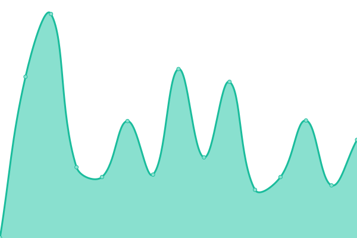

# [📈 Live Status](https://tradinglabs-io.github.io/gatewayfy-status): <!--live status--> **🟧 Partial outage**

This repository contains the open-source uptime monitor and status page for [TradingLabs](https://tradinglabs-io.github.io/gatewayfy-status), powered by [Upptime](https://github.com/upptime/upptime).

With [Upptime](https://upptime.js.org), you can get your own unlimited and free uptime monitor and status page, powered entirely by a GitHub repository. We use [Issues](https://github.com/tradinglabs-io/gatewayfy-status/issues) as incident reports, [Actions](https://github.com/tradinglabs-io/gatewayfy-status/actions) as uptime monitors, and [Pages](https://tradinglabs-io.github.io/gatewayfy-status) for the status page.

<!--start: status pages-->
<!-- This summary is generated by Upptime (https://github.com/upptime/upptime) -->
<!-- Do not edit this manually, your changes will be overwritten -->
<!-- prettier-ignore -->
| URL | Status | History | Response Time | Uptime |
| --- | ------ | ------- | ------------- | ------ |
|  [GatewayFy LP](https://www.gatewayfy.com) | 🟥 Down | [gateway-fy-lp.yml](https://github.com/tradinglabs-io/gatewayfy-status/commits/HEAD/history/gateway-fy-lp.yml) | 

 307ms
     
 | 

<a href="https://tradinglabs-io.github.io/gatewayfy-status/history/gateway-fy-lp">100.00%</a>
    

|  [GatewayFy App](https://app.gatewayfy.com) | 🟩 Up | [gateway-fy-app.yml](https://github.com/tradinglabs-io/gatewayfy-status/commits/HEAD/history/gateway-fy-app.yml) | 

 270ms
     
 | 

<a href="https://tradinglabs-io.github.io/gatewayfy-status/history/gateway-fy-app">24.75%</a>
    

|  [Quik App](https://app.quikbr.com) | 🟩 Up | [quik-app.yml](https://github.com/tradinglabs-io/gatewayfy-status/commits/HEAD/history/quik-app.yml) | 

 267ms
     
 | 

<a href="https://tradinglabs-io.github.io/gatewayfy-status/history/quik-app">100.00%</a>
    

|  [Quik Checkout](https://checkout.quikbr.com) | 🟩 Up | [quik-checkout.yml](https://github.com/tradinglabs-io/gatewayfy-status/commits/HEAD/history/quik-checkout.yml) | 

 247ms
     
 | 

<a href="https://tradinglabs-io.github.io/gatewayfy-status/history/quik-checkout">100.00%</a>
    

|  [Neon App](https://app.neonpay.com.br) | 🟩 Up | [neon-app.yml](https://github.com/tradinglabs-io/gatewayfy-status/commits/HEAD/history/neon-app.yml) | 

 356ms
     
 | 

<a href="https://tradinglabs-io.github.io/gatewayfy-status/history/neon-app">24.75%</a>
    

|  [Neon Checkout](https://checkout.neonpay.com.br) | 🟩 Up | [neon-checkout.yml](https://github.com/tradinglabs-io/gatewayfy-status/commits/HEAD/history/neon-checkout.yml) | 

 343ms
     
 | 

<a href="https://tradinglabs-io.github.io/gatewayfy-status/history/neon-checkout">24.75%</a>
    

<!--end: status pages-->

[**Visit our status website →**](https://tradinglabs-io.github.io/gatewayfy-status)

## 📄 License

- Powered by: [Upptime](https://github.com/upptime/upptime)
- Code: [MIT](./LICENSE) © [Anand Chowdhary](https://anandchowdhary.com), supported by [Pabio](https://pabio.com)
- Data in the `./history` directory: [Open Database License](https://opendatacommons.org/licenses/odbl/1-0/)
